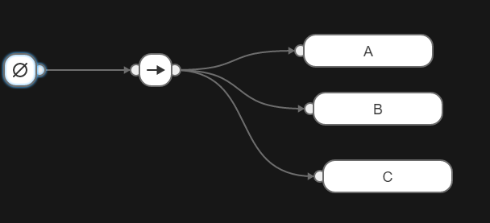
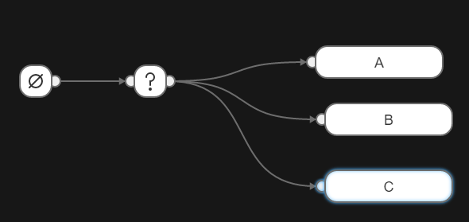
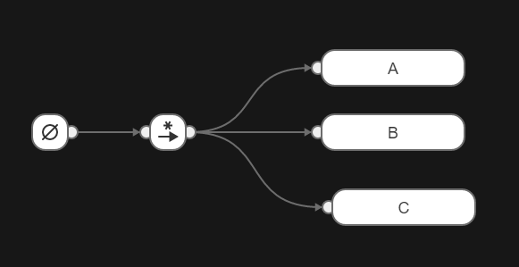
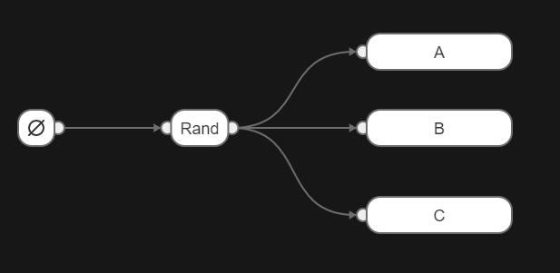
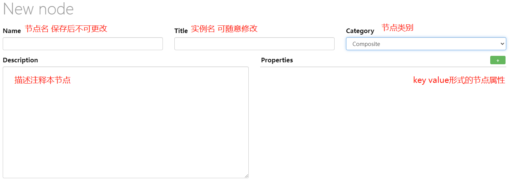

### 设计思路

框架层总体包含前端、后端、聚合应用三部分

- 前端front

  封装UI界面 

- 后端back

  提炼出客户端角度的玩家通用接口

  用户可继承，可重写

- 聚合应用app

  作为连接前端后端的桥梁

  封装一些框架接口

##### 前端

ui界面其实就是一个网页，内容就是index.html

开源库lorca负责拉起浏览器并访问index.html 

并且提供了GO与JS相互调用的接口

- GO调用JS

  假如js提供了函数add

  ```js
  function add(x, y){
      return x + y
  }
  ```

  在GO代码中调用add

  ```go
  ui.Eval(`add(2, 3)`).Int() // 
  ```

  调用操作已封装在calljs.go文件中

- JS调用GO

  go实现的函数

  ```go
  func Add(x, y int) int{
  	return x + y
  }
  // 调用 后相当于js环境有了Add这个变量
  ui.Bind("Add", Add)
  ```

  在JS代码中 使用

  ```js
  // 调用Add返回的是个promise 是异步的
  Add(1, 2).then((res)=>{
      console.log(res) // res = 3
  })
  ```

  实际调用已封装在fromjs.go中

除了实现GO JS互相调用外，还需实现一个静态文件服务器

让浏览器可以获取js、css等静态文件

具体实现在fileserver.go

##### 后端

主要是IGamer接口

```go
type IGamer interface {
	GetUid() string // 玩家唯一标识，登录前就要确定
	Close()         // 主动调用 关闭玩家
	OnExit()        // 退出回调

	MsgChan() <-chan interface{} // 消息channel
	ExitChan() <-chan struct{}   // exit channel
	ProcessMsg(interface{})      // 网络消息处理函数

	GetTickMs() int64 // 玩家间隔多少毫秒跑一遍行为树
    Stop() 			 // 让玩家停止跑行为树，但是不退出 此时不发消息只收消息 提升消息指标的精度
	IsStopped() bool // 
}
```

##### 聚合应用

主要就是IApp接口，用户直接继承即可

```go
type IApp interface {
	Init(*Options) // 初始化应用
	Run(context.Context) // 程序主循环，已有默认实现， 可按需重写
	Close()    // 关闭应用
	OnExit(reason string) // 应用退出回调

	// 根据配置文件创建一个玩家
	CreateGamer(confJson string, seq int32) (back.IGamer, error)
	RunGamer(g back.IGamer, tree *btree.Tree) // 玩家主循环 ，已有默认实现， 可按需重写

	// 解析pb结构体
	ParsePbInfo(back.IPbInfo)

	StressStart(start, count int32, treeID, confJs string) // 压测开始
	PrintStressStatus()     // 打印压测状态
}
```

### 行为树

配置文件在conf/robot.b3

开源behavior3go已经实现节点And、Or等基础控制逻辑 `https://github.com/magicsea/behavior3go`

可以自行扩展其他控制逻辑，比如随机执行等

#### 节点说明

##### 节点状态：

控制节点会根据状态做出决策

- Success

  成功

- ERROR

  失败

- Running

  表示节点会持续运行一定时间

##### 默认控制节点说明：

- Sequence

  相当于逻辑与操作

  下面的例子默认顺序执行A、B、C

   如果A返回失败，则不会继续执行B、C

  

- Priority

  相当于逻辑或

  如果A返回成功，则不会执行B、C

  

- MemSequence/MemPriority

  带Mem前缀的会记住返回running的节点，下次直接运行这个节点

  比如第一次遍历时C返回running

  则第二次遍历时会跳过运行A、B直接运行C

  

- 随机节点 Rand/MemRand

  - Rand类型 

    每次抽取均独立 即每次抽到A、B、C的概率相同

  - MemRand类型

    不放回抽取 第一次抽到了B 则第二次只能从A、C中选 假如是C 则第三次只能选择A

    抽完一轮则重置为初始状态

  



##### 自定义节点

编辑器中点击新建节点



Name相当于面向对象语言中的类型名，Title相当于实例名称，不同实例可同名

节点类别有分支节点和叶子节点两种类型

###### 分支节点

- Composite 组合节点

  可以包含多个节点

  自定义时内嵌btree.Composite结构体

  通关Len方法获取子节点数量，GetChild方法拿到子节点

- Decorator 装饰节点

  只包含一个节点

  自定义时内嵌btree.Decorator结构体

  通过GetChild方法拿到子节点

###### 叶子节点

承载业务逻辑的实现

自定义节点时内嵌btree.Action

实现时按需重写Inode接口中的方法即可，一般只需重写OnTick

```go
type INode interface {
	OnEnter(*Tick)       // 进入节点
	OnTick(*Tick) Status // 主要业务逻辑
	OnLeave(*Tick)       // 离开节点
	Execute(*Tick) Status // 节点控制逻辑 一般不用重写
}
```


##### 一个例子

实现自定义节点的步骤其实就是

- 先在编辑器中新建一个节点 假如Log节点
- 在画布中编排好节点保存配置
- 然后定义Log结构体，并内嵌对应的类型 比如btree.Action
- 再重写OnTick接口 实现自己的业务逻辑
- btree.Register注册结构体即可

```go
type Log struct {
	btree.Action
}

func (node *Log) OnTick(tick *btree.Tick) btree.Status {
	// node.Properties.Get() 获取属性
	fmt.Println("runNode", node.Id, node.Name, node.Title)
	return btree.SUCCESS
}

//注册节点
btree.Register(&Log{})
```

